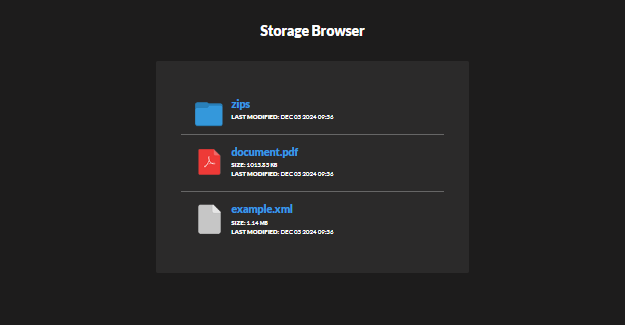
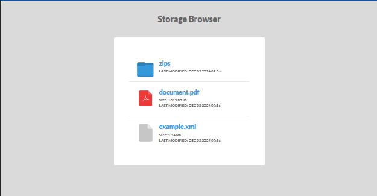
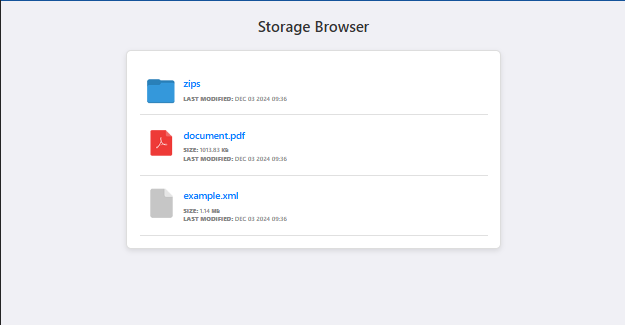
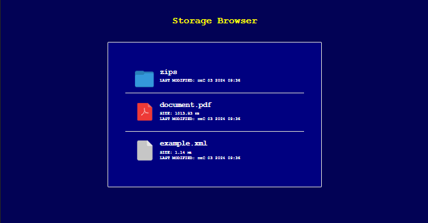
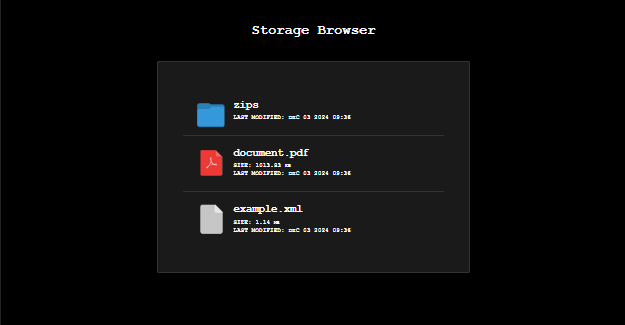
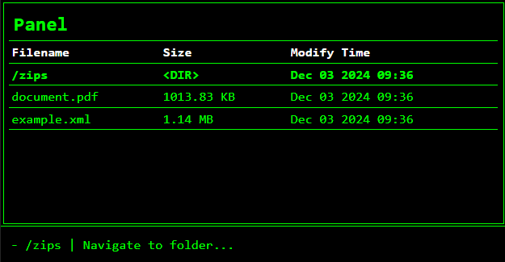
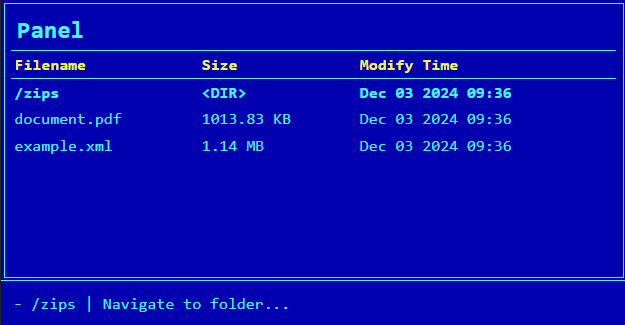
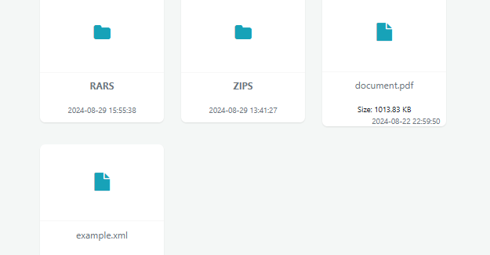
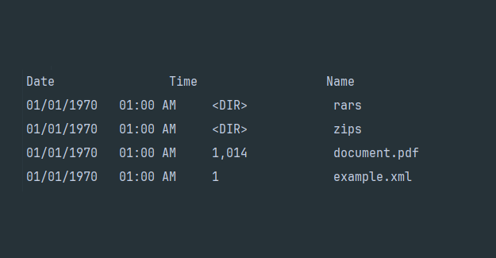

# Storage Navigator

[](https://github.com/marktaborosi)
[](https://github.com/marktaborosi/storage-navigator/releases)
[](https://github.com/marktaborosi/storage-navigator/blob/master/LICENSE)


[](https://github.com/marktaborosi/storage-navigator/actions)


# Table of Contents
- [Getting Started](#storage-navigator)
  - [Supported Adapters](#supported-adapters)
  - [Supported Renderers](#supported-renderers)
- [Installation](#installation)
- [Usage](#usage)
  - [Native Adapter Example](#native-adapter-example)
  - [Flysystem Adapter with Local Adapter Example](#flysystem-adapter-with-local-adapter-example)
  - [FTP Adapter Example](#ftp-adapter-example)
  - [SFTP Adapter Example](#sftp-adapter-example)
  - [S3 Adapter Example (Google / AWS)](#s3-adapter-example)
  - [Unified Archive Adapter Example](#unified-archive-adapter-example)
  - [ZIP Archive Adapter Example](#zip-archive-adapter-example)
- [Renderers](#renderers)
  - [HTML Renderer](#html-renderer)
    - [Configuration](#configuration)
    - [Themes](#themes)
  - [Console Renderer](#console-renderer)
- [File Structure Filtering](#file-structure-filtering)
  - [Usage](#usage-1)
  - [Filtering Options](#filtering-options)
    - [Filter by Type](#filter-by-type)
    - [Filter by Name](#filter-by-name)
    - [Filter by File Extension](#filter-by-file-extension)
    - [Combining Filters](#combining-filters)
  - [Retrieving the Filters](#retrieving-the-filters)
- [Creating your own Adapter](#creating-your-own-adapter)
  - [Understanding the StorageNavigatorAdapterInterface](#1-understanding-the-storagenavigatoradapterinterface)
  - [Steps to Implement a Custom Adapter](#2-steps-to-implement-a-custom-adapter)
    - [Create a New Class](#step-1-create-a-new-class)
    - [Implement the 'fileOrDirectorExists' Method](#step-2-implement-the-fileordirectoryexists-method)
    - [Implement the 'getFileStructure' Method](#step-3-implement-the-getfilestructure-method)
    - [Implement the 'downloadFile' Method](#step-4-implement-the-downloadfile-method)
  - [Example: Minimal Adapter](#3-example-minimal-adapter)
  - [Advanced Customization](#4-advanced-customization)
  - [Testing your Adapter](#5-testing-your-adapter)]
- [Creating your own Renderer](#creating-your-own-renderer)
  - [Understanding the StorageNavigatorRendererInterface](#1-understanding-the-storagenavigatorrendererinterface)
  - [Steps to Implement a Custom Renderer](#2-steps-to-implement-a-custom-renderer)
    - [Create a New Class](#step-1-create-a-new-class-1)
    - [Implement the 'render' Method](#step-2-implement-the-render-method)
    - [Implement the 'navigationHandler' Method](#step-3-implement-the-navigationhandler-method)
    - [Register and Use Your Renderer](#step-4-register-and-use-your-renderer)
  - [Minimal Renderer](#3-example-minimal-renderer)
  - [Advanced Customization](#4-advanced-customization-1)
  - [Testing Your Renderer](#5-testing-your-renderer)
- [Contributing](#contributing)

## Storage Navigator

A simple, lightweight, and universal storage/file browser and navigator library with rendering options.

This library allows accessing various storage systems via adapters and rendering their contents using different renderers. It supports navigating and displaying storage contents across various platforms, including FTP, SFTP, local filesystems, and more.

### Supported Adapters

Adapters are the backbone of the Storage Navigator library, enabling seamless integration with various storage systems. They act as abstraction layers that standardize communication with diverse storage backends, such as local file systems, cloud storage, FTP servers, and more. By decoupling the specific implementation details of storage systems, adapters ensure a unified interface for interacting with files and directories, regardless of the underlying storage type.

<small>Adapters allow developers to effortlessly navigate, manage, and interact with storage systems, making the library versatile and adaptable to a wide range of use cases.

<i>For advanced requirements, custom adapters can be implemented using the StorageNavigatorAdapterInterface, providing the flexibility to extend functionality and support additional storage platforms while maintaining compatibility with the library's architecture.</i>
</small>

- **Flysystem**: Provides integration with the *League\Flysystem* library for a unified filesystem interface. The following Flysystem adapters are currently available:
  - **Local**: Accesses and interacts with local file systems.
  - **Dropbox**: Provides access to Dropbox storage.
  - **Amazon S3 (AWS)**: Enables integration with Amazon S3 for cloud storage. Has AsyncAws too.
  - **Azure Blob**: Provides access to Microsoft Azure Blob Storage, allowing interaction with objects stored in Azure's cloud-based storage service.
  - **FTP**: Allows FTP connections for navigating and managing files on FTP servers using the built-in PHP `ftp_connect` function.
  - **SFTP**: Secure FTP connections to remote servers via SSH, utilizing the `phpseclib3\Net\SFTP` library for advanced secure file transfers.
  - **MongoDB GridFS**: Allows interaction with MongoDB's GridFS, a specification for storing large files in MongoDB, enabling streaming of large files.
  - **Rackspace**: Connects with Rackspace cloud storage for file management in cloud environments.
  - **Google Drive**: Provides access to Google Drive for cloud file management, allowing seamless interaction with Google’s storage.
  - **GitLab**: Accesses files stored on GitLab, a web-based Git repository manager, for managing repository data and artifacts.
  - **WebDAV**: Enables file interactions with WebDAV-compatible servers for remote file management.
  - **InMemory**: This adapter keeps the filesystem completely in memory, which is useful when you need a filesystem without persistence.

- **FTP Adapter**: Uses PHP's built-in `ftp_connect` function for connecting and navigating FTP servers. Ideal for legacy FTP setups.

- **SFTP Adapter**: Establishes secure FTP connections to remote servers using the `phpseclib3\Net\SFTP` class, supporting robust SSH-based file transfers.

- **Native Adapter**: Leverages PHP's built-in `scandir` function for accessing and interacting with local file systems. Suitable for basic filesystem navigation.

- **S3 Adapter**: S3 Storages like Google Cloud / AWS 

- **Unified Archive Adapter**: Provides access to various archive types using the *wapmorgan\UnifiedArchive* library. This includes support for:
  - `.zip`
  - `.tar`
  - `.tar.gz`
  - `.tar.bz2`
  - `.tar.xz`
  - `.rar`
  - `.7z`
  - `.gzip`
  - `.xz`
  - `.lzma`
  - `.iso`
  - `.ar`
  - `.cpio`

- **ZIP Archive Adapter**: Utilizes PHP's `ZipArchive` class to interact with and manage `.zip` archives, offering a convenient way to work with compressed files.

- **Null Adapter**: A placeholder adapter that does nothing, useful for debugging or testing without requiring actual storage interactions.


### Supported Renderers

A Renderer is a crucial component in the Storage Navigator library, responsible for transforming the raw data collected by the adapters into a visually interpretable format. Renderers determine how the storage contents, such as files and directories, are displayed to the user, whether in a web browser, a command-line interface, or a debugging environment. Each renderer is tailored to a specific context, providing the necessary features and styling to meet diverse usage scenarios. By decoupling the rendering logic from data retrieval, Storage Navigator ensures maximum flexibility and adaptability across different platforms and environments.

<small><i>For advanced scenarios, you can implement a custom renderer by utilizing the StorageNavigatorRendererInterface, which defines the necessary methods and structure for creating a tailored rendering solution. This allows developers to seamlessly integrate unique rendering logic that aligns with their application's requirements, while maintaining compatibility with the Storage Navigator ecosystem.</i></small>

- **HTML Renderer**: A fully-featured renderer designed for browsers, with support for various themes and file navigation options.
- **Console Renderer**: A simple CLI-based renderer for listing files, without navigation support.
- **Null Renderer**: A placeholder renderer, useful for debugging or specific use cases.

## Installation

You can install **Storage Navigator** via Composer:

```bash
composer require marktaborosi/storage-navigator
````

## Usage

Below are examples of how to use **Storage Navigator** with different adapters and renderers.

### Native Adapter Example

```php
use Marktaborosi\StorageNavigator\Adapters\PHPNativeAdapter;
use Marktaborosi\StorageNavigator\Builders\FileStructureFilterBuilder;
use Marktaborosi\StorageNavigator\Renderers\Config\HtmlRendererConfig;
use Marktaborosi\StorageNavigator\Renderers\HtmlRenderer;
use Marktaborosi\StorageNavigator\StorageNavigator;

// Create a native PHP adapter for filesystem operations
$adapter = new PHPNativeAdapter();

// Configure HTML renderer settings
$config = new HtmlRendererConfig([
    'date_format' => "Y-m-d H:i:s", // Set the format for displaying timestamps
]);

// Create an HTML renderer with a custom theme and options
$renderer = new HtmlRenderer(
    themePath: "basic-mac", // Set the theme path for styling
    config: $config, // Pass the renderer configuration
    disableNavigation: false, // Enable directory navigation
    disableFileDownload: false, // Allow file downloads
);

// Configure a filter to display only files
// Note: Additional filters can be applied using methods on $filterBuilder if needed
$filterBuilder = new FileStructureFilterBuilder();
$filterBuilder
    ->isFile() // Filter entries to include only files
    ->nameContains("my_name"); // Match files containing the specified name 

// Initialize the StorageNavigator with the configured components
$navigator = new StorageNavigator(
    adapter: $adapter, // Pass the PHP native filesystem adapter
    renderer: $renderer, // Pass the HTML renderer
    rootPath: __DIR__ . "/storage/", // Set the root directory to browse
    filterBuilder: $filterBuilder, // Apply the configured file filter
);

// Display the file structure in the browser
$navigator->display();
```


## Flysystem Adapter with Local Adapter Example

For detailed information on Flysystem, its adapters, and usage, please refer to the [Flysystem Documentation](https://flysystem.thephpleague.com/docs/).

```php
// Define the local filesystem adapter from league for the storage directory. 
$localAdapter = new LocalFilesystemAdapter(__DIR__ . "/storage/");
$filesystem = new Filesystem($localAdapter);

// Create a Flysystem adapter for use with StorageNavigator
$adapter = new FlysystemAdapter($filesystem);

// Configure the HTML renderer with specific settings
$config = new HtmlRendererConfig([
    'date_format' => "M d Y H:i", // Define date format for file timestamps
]);

// Create the HTML renderer with a specific theme and options
$renderer = new HtmlRenderer(
    themePath: 'console-midnight-commander2', // Set theme path
    config: $config, // Pass configuration
    disableNavigation: false, // Enable navigation
    disableFileDownload: false // Enable file downloads
);

// Configure filtering options for the file structure
// Note: Additional filters can be applied using methods on $filterBuilder if needed
$filterBuilder = new FileStructureFilterBuilder();
$filterBuilder
    ->isFile() // Filter to include only file entries
    ->nameContains('my_name.pdf'); // Match files containing the specified name

// Initialize the StorageNavigator with configured components
$navigator = new StorageNavigator(
    adapter: $adapter, // Pass the filesystem adapter
    renderer: $renderer, // Pass the HTML renderer
    rootPath: "", // Set the root path for the navigator
    filterBuilder: $filterBuilder, // Apply the configured filter builder
);

// Display the file structure in the browser
$navigator->display();
```

### FTP Adapter Example

```php
use Marktaborosi\StorageNavigator\Adapters\FTP\FtpConnection;
use Marktaborosi\StorageNavigator\Adapters\FtpAdapter;
use Marktaborosi\StorageNavigator\Builders\FileStructureFilterBuilder;
use Marktaborosi\StorageNavigator\Renderers\Config\HtmlRendererConfig;
use Marktaborosi\StorageNavigator\Renderers\HtmlRenderer;
use Marktaborosi\StorageNavigator\StorageNavigator;

// Create an FTP adapter for connecting to the FTP server
$adapter = new FtpAdapter(new FtpConnection());
$adapter->initialize(
    'test.rebex.net', // FTP server host
    'demo', // Username for authentication
    'password', // Password for authentication
    21, // FTP server port
    "/" // Initial directory path on the FTP server
);

// Configure HTML renderer settings
$config = new HtmlRendererConfig([
    'date_format' => "Y-m-d H:i:s", // Set the format for displaying file timestamps
]);

// Create an HTML renderer with a custom theme and options
$renderer = new HtmlRenderer(
    themePath: "basic-norton", // Set the theme path for styling
    config: $config, // Pass the renderer configuration
    disableNavigation: false, // Enable directory navigation
    disableFileDownload: false // Allow file downloads
);

// Configure filtering options for the file structure (optional)
// Note: Additional filters can be applied using methods on $filterBuilder if needed
$filterBuilder = new FileStructureFilterBuilder();
$filterBuilder->isFile(); // Shows only files

// Initialize the StorageNavigator with the configured components
$navigator = new StorageNavigator(
    adapter: $adapter, // Pass the FTP adapter
    renderer: $renderer, // Pass the HTML renderer
    rootPath: "", // Set the root directory to browse
    filterBuilder: $filterBuilder, // Apply the configured file filter
);

// Display the file structure in the browser
$navigator->display();
```

### SFTP Adapter Example

```php
use Marktaborosi\StorageNavigator\Adapters\SftpAdapter;
use Marktaborosi\StorageNavigator\Builders\FileStructureFilterBuilder;
use Marktaborosi\StorageNavigator\Renderers\Config\HtmlRendererConfig;
use Marktaborosi\StorageNavigator\Renderers\HtmlRenderer;
use Marktaborosi\StorageNavigator\StorageNavigator;

// Create an SFTP adapter for connecting to the SFTP server
$adapter = new SftpAdapter(
    'test.rebex.net',   // SFTP server address
    'demo',             // SFTP username
    'password',         // SFTP password
    22,                 // SFTP port (default 22)
    ""                  // Initial directory to browse
);

// Configure HTML renderer settings
$config = new HtmlRendererConfig([
    'date_format' => "Y-m-d H:i:s", // Define the date format for displaying timestamps
]);

// Create an HTML renderer with a custom theme and options
$renderer = new HtmlRenderer(
    themePath: "basic-norton", // Specify the theme path for styling
    config: $config, // Apply the renderer configuration
    disableNavigation: false, // Allow navigation between directories
    disableFileDownload: false // Enable file downloads
);

// Configure filtering options for the file structure (optional)
// Note: Additional filters can be applied using methods on $filterBuilder if needed
$filterBuilder = new FileStructureFilterBuilder();
$filterBuilder->isFile(); // Include only files in the displayed structure

// Initialize the StorageNavigator with the configured components
$navigator = new StorageNavigator(
    adapter: $adapter, // Pass the SFTP adapter
    renderer: $renderer, // Pass the HTML renderer
    rootPath: "", // Set the root directory to browse
    filterBuilder: $filterBuilder, // Apply the configured file filter
);

// Display the file structure in the browser
$navigator->display();
```

### S3 Adapter Example (Google / AWS)

```php
<?php

use Marktaborosi\StorageNavigator\Builders\FileStructureFilterBuilder;
use Marktaborosi\StorageNavigator\Renderers\Config\HtmlRendererConfig;
use Marktaborosi\StorageNavigator\Renderers\HtmlRenderer;
use Marktaborosi\StorageNavigator\StorageNavigator;

require_once '../vendor/autoload.php';

// Create  (You can use the S3 Adapter which works for both Google and AWS)
// You can use here GoogleCloudStorageAdapter() / AwsCloudStorageAdapter() if you want it more readable
$s3Client = new \Aws\S3\S3Client([
    'region' => 'us-east-1',
    'version' => 'latest',
    'endpoint' => 'https://your-endpoint.com',
    'credentials' => [
        'key' => 'your-client-key',
        'secret' => 'your-client-secret',
    ],
    // 'use_path_style_endpoint' => true,  // If MinIo is used, this is necessary
]);

$adapter = new \Marktaborosi\StorageNavigator\Adapters\AwsCloudStorageAdapter(
    'test-bucket',
    $s3Client

);

// Configure HTML renderer settings
$config = new HtmlRendererConfig([
    'date_format' => "Y-m-d H:i:s", // Set the format for displaying timestamps
]);

// Create an HTML renderer with a custom theme and options
$renderer = new HtmlRenderer(
    themePath: "basic-mac", // Set the theme path for styling
    config: $config, // Pass the renderer configuration
    disableNavigation: false, // Enable directory navigation
    disableFileDownload: false, // Allow file downloads
);

// Configure a filter to display only files
// Note: Additional filters can be applied using methods on $filterBuilder if needed
$filterBuilder = new FileStructureFilterBuilder();

// Initialize the StorageNavigator with the configured components
$navigator = new StorageNavigator(
    adapter: $adapter, // Pass the PHP native filesystem adapter
    renderer: $renderer, // Pass the HTML renderer
    rootPath: "", // Set the root directory to browse
    filterBuilder: $filterBuilder, // Apply the configured file filter
);

// Display the file structure in the browser
$navigator->display();
```

### Unified Archive Adapter Example

```php
use Marktaborosi\StorageNavigator\Adapters\UnifiedArchiveAdapter;
use Marktaborosi\StorageNavigator\Builders\FileStructureFilterBuilder;
use Marktaborosi\StorageNavigator\Renderers\Config\HtmlRendererConfig;
use Marktaborosi\StorageNavigator\Renderers\HtmlRenderer;
use Marktaborosi\StorageNavigator\StorageNavigator;

// Create a ZIP archive adapter to interact with the specified archive
$adapter = new UnifiedArchiveAdapter(__DIR__ . "/storage/zips/1mb-fake-sample.zip");

// Configure HTML renderer settings
$config = new HtmlRendererConfig([
    'date_format' => "Y-m-d H:i:s", // Define the format for displaying timestamps
]);

// Create an HTML renderer with a custom theme and options
$renderer = new HtmlRenderer(
    themePath: "basic-mac", // Specify the theme path for styling
    config: $config, // Apply the renderer configuration
    disableNavigation: false, // Allow directory navigation
    disableFileDownload: false // Enable file downloads
);

// Configure a filter to display only files
// Note: Additional filters can be applied using methods on $filterBuilder if needed
$filterBuilder = new FileStructureFilterBuilder();
$filterBuilder
    ->isFile(); // Include only files in the displayed structure

// Initialize the StorageNavigator with the configured components
$navigator = new StorageNavigator(
    adapter: $adapter, // Pass the archive adapter
    renderer: $renderer, // Pass the HTML renderer
    rootPath: "", // Set the root directory to browse
    filterBuilder: $filterBuilder, // Apply the configured file filter
);

// Display the file structure in the browser
$navigator->display();

```

### ZIP Archive Adapter Example

```php
use Marktaborosi\StorageNavigator\Adapters\ZipArchiveAdapter;
use Marktaborosi\StorageNavigator\Builders\FileStructureFilterBuilder;
use Marktaborosi\StorageNavigator\Renderers\Config\HtmlRendererConfig;
use Marktaborosi\StorageNavigator\Renderers\HtmlRenderer;
use Marktaborosi\StorageNavigator\StorageNavigator;

// Create a ZIP archive adapter to interact with the specified archive
try {
    $adapter = new ZipArchiveAdapter(__DIR__ . "/storage/zips/1mb-fake-sample.zip");
} catch (Exception $e) {
    die($e); // Terminate execution if the ZIP archive cannot be accessed
}

// Configure HTML renderer settings
$config = new HtmlRendererConfig([
    'date_format' => "Y-m-d H:i:s", // Define the format for displaying timestamps
]);

// Create an HTML renderer with a custom theme and options
$renderer = new HtmlRenderer(
    themePath: "basic-mac", // Specify the theme path for styling
    config: $config, // Apply the renderer configuration
    disableNavigation: false, // Allow directory navigation
    disableFileDownload: false // Enable file downloads
);

// Configure a filter to display only files
// Additional filters can be applied using methods on $filterBuilder if needed
$filterBuilder = new FileStructureFilterBuilder();
$filterBuilder
    ->isFile(); // Include only files in the displayed structure

// Initialize the StorageNavigator with the configured components
// Note: Additional filters can be applied using methods on $filterBuilder if needed
$navigator = new StorageNavigator(
    adapter: $adapter, // Pass the archive adapter
    renderer: $renderer, // Pass the HTML renderer
    rootPath: "", // Set the root directory to browse
    filterBuilder: $filterBuilder, // Apply the configured file filter
);

// Display the file structure in the browser
$navigator->display();
```

# Renderers

### HTML Renderer
#### Configuration

You can configure various options for the file browser, such as:

- **date_format**: The format for displaying file modification dates. This follows the same format as PHP's date() function. For example, Y-m-d H:i:s would display dates as 2024-01-01 15:30:00.
<br><br>
#### Themes

HTML Renderer has navigation and file download support.
Each theme provides a different look and feel for the file browser.

Below are some screenshots of the available themes:

<div style="display: grid; grid-template-columns: repeat(auto-fill, minmax(200px, 1fr)); gap: 10px;">
    <div style="text-align: center;">
        
        <p><strong>basic-dark</strong></p>
    </div>
    <div style="text-align: center;">
        
        <p><strong>basic-light</strong></p>
    </div>
    <div style="text-align: center;">
        
        <p><strong>basic-mac</strong></p>
    </div>
    <div style="text-align: center;">
        
        <p><strong>basic-norton</strong></p>
    </div>
    <div style="text-align: center;">
        
        <p><strong>basic-terminal</strong></p>
    </div>
    <div style="text-align: center;">
        
        <p><strong>console-hacker</strong></p>
    </div>
    <div style="text-align: center;">
        
        <p><strong>console-midnight-commander</strong></p>
    </div>
    <div style="text-align: center;">
        
        <p><strong>console-norton-commander</strong></p>
    </div>
<div style="text-align: center;">
        
        <p><strong>bootstrap-mason-light</strong></p>
    </div>
</div>


## Console Renderer

*Important! The Console renderer does not have navigation functionality.*

To use the Console Renderer in a CLI environment, you can instantiate it as follows:

```php
// Create renderer
$renderer = new \Marktaborosi\StorageNavigator\Renderers\ConsoleRenderer();
```
It looks structurally similar to a Windows DIR command:
<div style="display: grid; grid-template-columns: repeat(auto-fill, minmax(300px, 1fr)); gap: 10px;">
    <div style="text-align: center;">
        
    </div>
</div>

# File Structure Filtering

The `FileStructureFilterBuilder` class is a utility for constructing filters to navigate and filter file and directory structures. It allows fine-grained control over what files or directories are displayed by applying various filtering criteria.

---

## Usage

The `FileStructureFilterBuilder` provides a fluent interface to add filters. Each filter can narrow down the results based on file or directory attributes such as name, type, or extension.

> **Note**: Currently, all filters are combined using a logical "AND" operation. Logical expressions such as "OR" or grouped conditions are under development.

---

## Filtering Options

### 1. **Filter by Type**
- **`isFile()`**
  - Includes only files in the results.
  - **Example**:
    ```php
    $filterBuilder->isFile();
    ```

- **`isDirectory()`**
  - Includes only directories in the results.
  - **Example**:
    ```php
    $filterBuilder->isDirectory();
    ```

---

### 2. **Filter by Name**
- **`nameEquals(string|array $filenames)`**
  - Includes files or directories whose names match the given values exactly.
  - **Example**:
    ```php
    $filterBuilder->nameEquals(['file1.txt', 'file2.log']);
    ```

- **`nameNotEquals(string|array $filenames)`**
  - Excludes files or directories whose names match the given values.
  - **Example**:
    ```php
    $filterBuilder->nameNotEquals('example.txt');
    ```

- **`nameContains(string|array $substrings)`**
  - Includes files or directories whose names contain any of the specified substrings.
  - **Example**:
    ```php
    $filterBuilder->nameContains(['log', 'data']);
    ```

- **`nameNotContains(string|array $substrings)`**
  - Excludes files or directories whose names contain any of the specified substrings.
  - **Example**:
    ```php
    $filterBuilder->nameNotContains(['tmp', 'backup']);
    ```

---

### 3. **Filter by File Extension**
*(Applies only to files.)*

- **`extensionEquals(string|array $extensions)`**
  - Includes files whose extensions match the given values.
  - **Example**:
    ```php
    $filterBuilder->extensionEquals(['txt', 'log']);
    ```

- **`extensionNotEquals(string|array $extensions)`**
  - Excludes files whose extensions match the given values.
  - **Example**:
    ```php
    $filterBuilder->extensionNotEquals('exe');
    ```

- **`extensionContains(string|array $substrings)`**
  - Includes files whose extensions contain any of the specified substrings.
  - **Example**:
    ```php
    $filterBuilder->extensionContains('gz');
    ```

- **`extensionNotContains(string|array $substrings)`**
  - Excludes files whose extensions contain any of the specified substrings.
  - **Example**:
    ```php
    $filterBuilder->extensionNotContains('tmp');
    ```

---

### 4. **Combining Filters**

All filters are combined with a logical "AND" operation. This means that only files or directories that meet **all** the specified conditions will be included.

#### Example:
To include only `.txt` files whose names contain `log`:
```php
$filterBuilder
    ->isFile()
    ->nameContains('log')
    ->extensionEquals('txt');
```

---

## Retrieving the Filters
Once all filters are configured, you can retrieve them using the `getFilters()` method. The filters are returned as an array of callables that can be applied to entries in the file structure.

```php
$filters = $filterBuilder->getFilters();
```
---

# Creating Your Own Adapter

The **StorageNavigatorAdapterInterface** provides a contract for creating custom adapters in the Storage Navigator library. Adapters are responsible for interacting with various storage backends, such as local file systems, SFTP servers, or cloud storage solutions, and translating their structure and operations into a standardized format for the Storage Navigator.

This guide outlines the steps to implement your own adapter.

---

## 1. Understanding the StorageNavigatorAdapterInterface

The **StorageNavigatorAdapterInterface** defines three core methods:

- **`fileOrDirectoryExists(string $location): bool`**  
  Checks if a file or directory exists at the specified location.

- **`getFileStructure(string $location): FileStructure`**  
  Retrieves the structure of files and directories at a given location, returning a `FileStructure` object.

- **`downloadFile(string $filePath): void`**  
  Handles the downloading of a specified file, typically sending it to the client.

---

## 2. Steps to Implement a Custom Adapter

### Step 1: Create a New Class

Start by creating a class that implements the `StorageNavigatorAdapterInterface`.

```php
namespace YourNamespace;

use Marktaborosi\StorageNavigator\Entities\FileStructure;
use Marktaborosi\StorageNavigator\Interfaces\StorageNavigatorAdapterInterface;

class YourCustomAdapter implements StorageNavigatorAdapterInterface
{
    public function fileOrDirectoryExists(string $location): bool
    {
        // Implement your logic here
    }

    public function getFileStructure(string $location): FileStructure
    {
        // Implement your logic here
    }

    public function downloadFile(string $filePath): void
    {
        // Implement your logic here
    }
}
```

---

### Step 2: Implement the `fileOrDirectoryExists` Method

This method determines if a file or directory exists at the specified location.  
For example, in a cloud storage adapter, you might query the storage API:

```php
public function fileOrDirectoryExists(string $location): bool
{
    // Example: Check existence in a cloud storage system
    return $this->apiClient->exists($location);
}
```

For local file systems, you can use PHP's `file_exists` function:

```php
public function fileOrDirectoryExists(string $location): bool
{
    return file_exists($location);
}
```

---

### Step 3: Implement the `getFileStructure` Method

This method retrieves the structure of a directory and returns it as a `FileStructure` object. You can use the `FileStructureBuilder` class to construct the structure.

Example for a local file system:
```php
use Marktaborosi\StorageNavigator\Builders\FileStructureBuilder;
use Marktaborosi\StorageNavigator\Entities\DirectoryAttribute;
use Marktaborosi\StorageNavigator\Entities\FileAttribute;
use Marktaborosi\StorageNavigator\Entities\FileStructure;

public function getFileStructure(string $location): FileStructure
{
    $entries = scandir($location);
    $structureBuilder = new FileStructureBuilder();

    foreach ($entries as $entry) {
        $path = $location . DIRECTORY_SEPARATOR . $entry;

        if ($entry === '.' || $entry === '..') {
            continue;
        }

        if (is_dir($path)) {
            $structureBuilder->addDirectory(new DirectoryAttribute(
                name: $entry,
                path: $path,
                lastModified: filemtime($path)
            ));
        } else {
            $structureBuilder->addFile(new FileAttribute(
                directoryPath: dirname($path),
                filename: $entry,
                extension: pathinfo($path, PATHINFO_EXTENSION),
                byteSize: filesize($path),
                lastModified: filemtime($path)
            ));
        }
    }

    return $structureBuilder->sortByAZ()->build();
}
```

---

### Step 4: Implement the `downloadFile` Method

The `downloadFile` method handles file downloading. This typically involves sending the file's contents to the client with appropriate HTTP headers.

Example:
```php
public function downloadFile(string $filePath): void
{
    header('Content-Type: application/octet-stream');
    header('Content-Disposition: attachment; filename="' . basename($filePath) . '"');
    header('Content-Length: ' . filesize($filePath));
    readfile($filePath);
}
```

---

## 3. Example: Minimal Adapter

Here's a minimal example of an adapter for a custom storage system:

```php
namespace YourNamespace;

use Marktaborosi\StorageNavigator\Entities\FileStructure;
use Marktaborosi\StorageNavigator\Interfaces\StorageNavigatorAdapterInterface;

class CustomStorageAdapter implements StorageNavigatorAdapterInterface
{
    public function fileOrDirectoryExists(string $location): bool
    {
        // Example logic to check existence
        return true;
    }

    public function getFileStructure(string $location): FileStructure
    {
        // Example: Return an empty FileStructure
        return new FileStructure([]);
    }

    public function downloadFile(string $filePath): void
    {
        // Example: Serve a static file
        header('Content-Type: text/plain');
        echo "File contents for {$filePath}";
    }
}
```

---

## 4. Advanced Customization

For complex storage systems, consider:
- **Using APIs**: Integrate with APIs provided by cloud storage platforms like AWS S3, Google Drive, or Azure Blob Storage.
- **Authentication**: Implement secure connections using authentication tokens, SSH keys, or API keys.
- **Error Handling**: Handle cases where files or directories are missing, permissions are restricted, or connections fail.

---

## 5. Testing Your Adapter

Test your adapter thoroughly with:
- Different file structures, including deeply nested directories.
- Edge cases like empty directories or invalid paths.
- File downloads of various sizes and types.

---

By following these steps, you can create a custom adapter that integrates seamlessly with the Storage Navigator library and provides access to your desired storage backend.


# Creating Your Own Renderer

The **StorageNavigatorRendererInterface** defines a flexible and extensible contract for creating custom renderers in the Storage Navigator library. Renderers are responsible for displaying the data fetched by adapters in a desired format, whether as an HTML page, CLI output, or any other custom view.

This guide walks you through the process of implementing your own custom renderer.

---

## 1. Understanding the StorageNavigatorRendererInterface

The **StorageNavigatorRendererInterface** contains two core methods you need to implement:

- **`render(RenderData $data): void`**  
  This method is responsible for generating and displaying the output based on the provided `RenderData`. You can customize the way data is displayed, such as creating HTML pages, console output, or even JSON responses.

- **`navigationHandler(): StorageNavigatorNavigationHandlerInterface`**  
  This method provides a navigation handler to process navigation-related actions, like changing directories or downloading files.

---

## 2. Steps to Implement a Custom Renderer

### Step 1: Create a New Class

Start by creating a class that implements the `StorageNavigatorRendererInterface`.

```php
namespace YourNamespace;

use Marktaborosi\StorageNavigator\Interfaces\StorageNavigatorRendererInterface;
use Marktaborosi\StorageNavigator\Interfaces\StorageNavigatorNavigationHandlerInterface;
use Marktaborosi\StorageNavigator\Renderers\Entities\RenderData;

class YourCustomRenderer implements StorageNavigatorRendererInterface
{
    public function render(RenderData $data): void
    {
        // Implement the rendering logic here
    }

    public function navigationHandler(): StorageNavigatorNavigationHandlerInterface
    {
        // Return your custom navigation handler
    }
}
```

---

### Step 2: Implement the `render` Method

The `render` method receives a `RenderData` object, which contains the current file structure, navigation paths, and other data needed for rendering. Customize this method to output the data in your desired format.

For example, to render as JSON:
```php
public function render(RenderData $data): void
{
    header('Content-Type: application/json');
    echo json_encode($data->getStructure()->toArray(), JSON_PRETTY_PRINT);
}
```

---

### Step 3: Implement the `navigationHandler` Method

The `navigationHandler` method returns a `StorageNavigatorNavigationHandlerInterface` implementation. This handles navigation actions like changing directories or downloading files.

If no navigation logic is needed, you can return a `NullNavigationHandler`:
```php
public function navigationHandler(): StorageNavigatorNavigationHandlerInterface
{
    return new NullNavigationHandler();
}
```

For custom navigation handling, create a new class implementing `StorageNavigatorNavigationHandlerInterface`:

```php
use Marktaborosi\StorageNavigator\Interfaces\StorageNavigatorNavigationHandlerInterface;

class CustomNavigationHandler implements StorageNavigatorNavigationHandlerInterface
{
    public function isChangePathRequest(): bool { /* Your logic */ }
    public function isDownloadFileRequest(): bool { /* Your logic */ }
    public function changeToPath(): string { /* Your logic */ }
    public function downloadFilePath(): string { /* Your logic */ }
}
```

---

### Step 4: Register and Use Your Renderer

Instantiate your custom renderer and pass it to the `StorageNavigator`:

```php
use Marktaborosi\StorageNavigator\StorageNavigator;
use YourNamespace\YourCustomRenderer;

$renderer = new YourCustomRenderer();
$navigator = new StorageNavigator(
    adapter: $yourAdapter,
    renderer: $renderer,
    rootPath: '/path/to/root'
);

$navigator->display();
```

---

## 3. Example: Minimal Renderer

Here's a minimal example of a renderer that outputs a plain-text file list:

```php
namespace YourNamespace;

use Marktaborosi\StorageNavigator\Interfaces\StorageNavigatorRendererInterface;
use Marktaborosi\StorageNavigator\Interfaces\StorageNavigatorNavigationHandlerInterface;
use Marktaborosi\StorageNavigator\Renderers\Entities\RenderData;
use Marktaborosi\StorageNavigator\Renderers\Navigators\NullNavigationHandler;

class PlainTextRenderer implements StorageNavigatorRendererInterface
{
    public function render(RenderData $data): void
    {
        foreach ($data->getStructure()->toArray() as $file) {
            echo $file['name'] . PHP_EOL;
        }
    }

    public function navigationHandler(): StorageNavigatorNavigationHandlerInterface
    {
        return new NullNavigationHandler();
    }
}
```

---

## 4. Advanced Customization

You can leverage additional tools or libraries, like Twig for templating, or integrate third-party APIs for advanced rendering. For instance:
- Use **Twig** for creating dynamic and styled HTML outputs.
- Generate downloadable CSV or PDF reports using libraries like `FPDF` or `PhpSpreadsheet`.
- Create a REST API endpoint to serve the file structure in JSON or XML formats.

---

## 5. Testing Your Renderer

Before integrating your renderer, test it with different data sets to ensure it handles various file structures, edge cases, and error scenarios. Use the `RenderData` class to simulate test inputs.

---

By following these steps, you can create a custom renderer tailored to your application's needs while maintaining compatibility with the Storage Navigator's architecture.

# Contributing

If you'd like to contribute to the project, feel free to fork the repository and submit a pull request.
