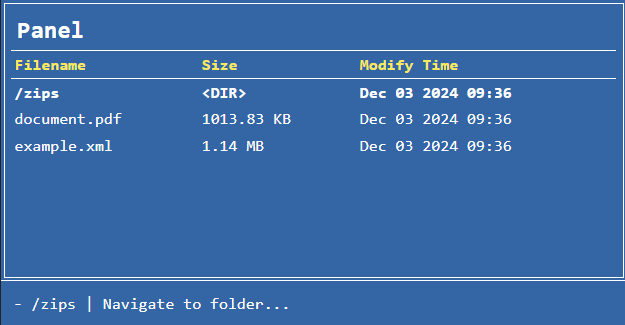

# Storage Navigator

[](https://github.com/marktaborosi)
[](https://github.com/marktaborosi/storage-navigator/releases)
[](https://github.com/thephpleague/flysystem/blob/master/LICENSE)
[](https://github.com/thephpleague/flysystem/actions?query=workflow%3A%22Quality+Assurance%22)


A simple, lightweight, and universal storage/file browser and navigator library with rendering options.

This library allows accessing various storage systems via adapters and rendering their contents using different renderers. It supports navigating and displaying storage contents across various platforms, including FTP, SFTP, local filesystems, and more.

## Supported Adapters

- **Flysystem**: Provides integration with the *League\Flysystem* library for a unified filesystem interface. The following Flysystem adapters are currently available:
  - **Local**: Accesses and interacts with local file systems.
  - **Dropbox**: Provides access to Dropbox storage.
  - **Amazon S3 (AWS)**: Enables integration with Amazon S3 for cloud storage. Has AsyncAws too.
  - **Azure Blob**: Provides access to Microsoft Azure Blob Storage, allowing interaction with objects stored in Azure's cloud-based storage service.
  - **FTP**: Allows FTP connections for navigating and managing files on FTP servers using the built-in PHP `ftp_connect` function.
  - **SFTP**: Secure FTP connections to remote servers via SSH, utilizing the `phpseclib3\Net\SFTP` library for advanced secure file transfers.
  - **MongoDB GridFS**: Allows interaction with MongoDB's GridFS, a specification for storing large files in MongoDB, enabling streaming of large files.
  - **Rackspace**: Connects with Rackspace cloud storage for file management in cloud environments.
  - **Google Drive**: Provides access to Google Drive for cloud file management, allowing seamless interaction with Google’s storage.
  - **GitLab**: Accesses files stored on GitLab, a web-based Git repository manager, for managing repository data and artifacts.
  - **WebDAV**: Enables file interactions with WebDAV-compatible servers for remote file management.
  - **InMemory**: This adapter keeps the filesystem completely in memory, which is useful when you need a filesystem without persistence.

- **FTP Adapter**: Uses PHP's built-in `ftp_connect` function for connecting and navigating FTP servers. Ideal for legacy FTP setups.

- **SFTP Adapter**: Establishes secure FTP connections to remote servers using the `phpseclib3\Net\SFTP` class, supporting robust SSH-based file transfers.

- **Native Adapter**: Leverages PHP's built-in `scandir` function for accessing and interacting with local file systems. Suitable for basic filesystem navigation.

- **Unified Archive Adapter**: Provides access to various archive types using the *wapmorgan\UnifiedArchive* library. This includes support for:
  - `.zip`
  - `.tar`
  - `.tar.gz`
  - `.tar.bz2`
  - `.tar.xz`
  - `.rar`
  - `.7z`
  - `.gzip`
  - `.xz`
  - `.lzma`
  - `.iso`
  - `.ar`
  - `.cpio`

- **ZIP Archive Adapter**: Utilizes PHP's `ZipArchive` class to interact with and manage `.zip` archives, offering a convenient way to work with compressed files.

- **Null Adapter**: A placeholder adapter that does nothing, useful for debugging or testing without requiring actual storage interactions.


## Renderers

- **HTML Renderer**: A fully-featured renderer designed for browsers, with support for various themes and file navigation options.
- **Console Renderer**: A simple CLI-based renderer for listing files, without navigation support.
- **Null Renderer**: A placeholder renderer, useful for debugging or specific use cases.

## Installation

You can install **Storage Navigator** via Composer:

```bash
composer require marktaborosi/storage-navigator
````

## Usage

Below are examples of how to use **Storage Navigator** with different adapters and renderers.

### Native Adapter Example

```php
use Marktaborosi\StorageBrowser\Adapters\PHPNativeAdapter;
use Marktaborosi\StorageBrowser\Config\FileBrowserConfig;
use Marktaborosi\StorageBrowser\Renderers\HtmlRenderer;
use Marktaborosi\StorageBrowser\StorageBrowser;

$adapter = new PHPNativeAdapter();

// Create config
$config = new FileBrowserConfig([
    'date_format' => "Y-m-d H:i:s", // Format for displaying file modification dates (same format as PHP's `date()` function)
    'ignore_filenames' => [], // An array of specific filenames to exclude from the view.
    'ignore_extensions' => [] // A list of file extensions to exclude from the view.
]);

// Create renderer
$renderer = new HtmlRenderer(
    themePath: "console-norton-commander", // Theme to use for rendering
    disableNavigation: false, // Set to true to disable navigation, only allowing browsing in the current folder
    disableFileDownload: false // Set to true to disable file downloads upon click
);

$browser = new StorageBrowser(
    adapter: $adapter,
    renderer: $renderer,
    config: $config,
    rootPath: __DIR__ . "/storage/" // Starting directory of the filesystem
);

$browser->display();
```


## Flysystem Adapter with Local Adapter Example

For detailed information on Flysystem, its adapters, and usage, please refer to the [Flysystem Documentation](https://flysystem.thephpleague.com/docs/).

```php
use League\Flysystem\Filesystem;
use League\Flysystem\Local\LocalFilesystemAdapter;
use Marktaborosi\StorageBrowser\Adapters\FlysystemAdapter;
use Marktaborosi\StorageBrowser\Config\FileBrowserConfig;
use Marktaborosi\StorageBrowser\Renderers\HtmlRenderer;
use Marktaborosi\StorageBrowser\StorageBrowser;

$localAdapter = new LocalFilesystemAdapter('your_location_here');
$filesystem = new Filesystem($localAdapter);
$adapter = new FlysystemAdapter($filesystem);

$renderer = new HtmlRenderer(themePath: 'console-midnight-commander');
$config = new FileBrowserConfig([
    'date_format' => "M d Y H:i", // Format for displaying file modification dates (same format as PHP's `date()` function)
    'ignore_filenames' => ["file.log"], // Exclude file.log from list
    'ignore_extensions' => ['zip', 'php', 'html'] // Exclude files with these extensions
]);

$browser = new StorageBrowser(
    adapter: $adapter,
    renderer: $renderer,
    config: $config,
    rootPath: "" // Starting directory of the filesystem
);

$browser->display();
```

### FTP Adapter Example

```php
use Marktaborosi\StorageBrowser\Adapters\FTP\FtpConnection;
use Marktaborosi\StorageBrowser\Adapters\FtpAdapter;
use Marktaborosi\StorageBrowser\Config\FileBrowserConfig;
use Marktaborosi\StorageBrowser\Renderers\HtmlRenderer;
use Marktaborosi\StorageBrowser\StorageBrowser;

// Initialize FTP adapter
$adapter = new FtpAdapter(new FtpConnection());

$adapter->initialize(
    'test.rebex.net',   // FTP server address
    'demo',             // FTP username
    'password',         // FTP password
    21,                 // FTP port (default 21)
    "/"                 // Initial directory
);

// Create renderer
$renderer = new HtmlRenderer(themePath: 'console-norton-commander');

// Create config
$config = new FileBrowserConfig([
    'ignore_filenames' => [],
    'ignore_extensions' => [],
]);

$browser = new StorageBrowser(
    adapter: $adapter,
    renderer: $renderer,
    config: $config,
    rootPath: ""
);

$browser->display();
```

### SFTP Adapter Example

```php
use Marktaborosi\StorageBrowser\Adapters\SftpAdapter;
use Marktaborosi\StorageBrowser\Config\FileBrowserConfig;
use Marktaborosi\StorageBrowser\Renderers\HtmlRenderer;
use Marktaborosi\StorageBrowser\StorageBrowser;

// Initialize SFTP adapter
$adapter = new SftpAdapter(
    'test.rebex.net',   // SFTP server address
    'demo',             // SFTP username
    'password',         // SFTP password
    22,                 // SFTP port (default 22)
    ""                  // Initial directory
);

// Create renderer
$renderer = new HtmlRenderer(themePath: 'console-norton-commander');

// Create config
$config = new FileBrowserConfig([
    'ignore_filenames' => [],
    'ignore_extensions' => [],
]);

$browser = new StorageBrowser(
    adapter: $adapter,
    renderer: $renderer,
    config: $config,
    rootPath: ""
);

$browser->display();
```

### Unified Archive Adapter Example

```php
use Marktaborosi\StorageBrowser\Adapters\UnifiedArchiveAdapter;
use Marktaborosi\StorageBrowser\Config\FileBrowserConfig;
use Marktaborosi\StorageBrowser\Renderers\HtmlRenderer;
use Marktaborosi\StorageBrowser\StorageBrowser;

// Initialize Unified Archive adapter
$adapter = new UnifiedArchiveAdapter('your_rar_location/your_rar_file.rar');

// Create renderer
$renderer = new HtmlRenderer(themePath: 'console-norton-commander');

// Create config
$config = new FileBrowserConfig();

$browser = new StorageBrowser(
    adapter: $adapter,
    renderer: $renderer,
    config: $config,
    rootPath: ""
);

// Render Browser
$browser->display();
```

### ZIP Archive Adapter Example

```php
use Marktaborosi\StorageBrowser\Adapters\ZipArchiveAdapter;
use Marktaborosi\StorageBrowser\Config\FileBrowserConfig;
use Marktaborosi\StorageBrowser\Renderers\HtmlRenderer;
use Marktaborosi\StorageBrowser\StorageBrowser;

// Initialize ZIP Archive adapter
$adapter = new ZipArchiveAdapter("your_zip_location/your_zip_file.zip");

// Create renderer
$renderer = new HtmlRenderer(themePath: 'console-norton-commander');

// Create config
$config = new FileBrowserConfig([
]);

$browser = new StorageBrowser(
    adapter: $adapter,
    renderer: $renderer,
    config: $config,
    rootPath: ""
);

// Render Browser
$browser->display();
```

## Configuration

You can configure various options for the file browser, such as:

- **date_format**: The format for displaying file modification dates. This follows the same format as PHP's date() function. For example, Y-m-d H:i:s would display dates as 2024-01-01 15:30:00.
  
- **ignore_filenames**: An array of specific filenames that should be ignored. This can be useful for excluding temporary or system files from the view.
  
- **ignore_extensions**: A list of file extensions to exclude. For instance, you might exclude zip files or certain types of configuration files by adding them to this array.

## Console Renderer

*Important! The Console renderer does not have navigation functionality.*

To use the Console Renderer in a CLI environment, you can instantiate it as follows:

```php
// Create renderer
$renderer = new \Marktaborosi\StorageBrowser\Renderers\ConsoleRenderer();
```
It looks structurally similar to a Windows DIR command:
<div style="display: grid; grid-template-columns: repeat(auto-fill, minmax(300px, 1fr)); gap: 10px;">
    <div style="text-align: center;">
        
    </div>
</div>

## HTTP Renderer Themes

HTTP Renderer has navigation and file download support.
Each theme provides a different look and feel for the file browser.
Check themes at the end of documentation.

Below are some screenshots of the available themes:

<div style="display: grid; grid-template-columns: repeat(auto-fill, minmax(200px, 1fr)); gap: 10px;">
    <div style="text-align: center;">
        
        <p><strong>basic-dark</strong></p>
    </div>
    <div style="text-align: center;">
        
        <p><strong>basic-light</strong></p>
    </div>
    <div style="text-align: center;">
        
        <p><strong>basic-mac</strong></p>
    </div>
    <div style="text-align: center;">
        
        <p><strong>basic-norton</strong></p>
    </div>
    <div style="text-align: center;">
        
        <p><strong>basic-terminal</strong></p>
    </div>
    <div style="text-align: center;">
        
        <p><strong>console-hacker</strong></p>
    </div>
    <div style="text-align: center;">
        
        <p><strong>console-midnight-commander</strong></p>
    </div>
    <div style="text-align: center;">
        
        <p><strong>console-norton-commander</strong></p>
    </div>
</div>


## Contributing

If you'd like to contribute to the project, feel free to fork the repository and submit a pull request.
